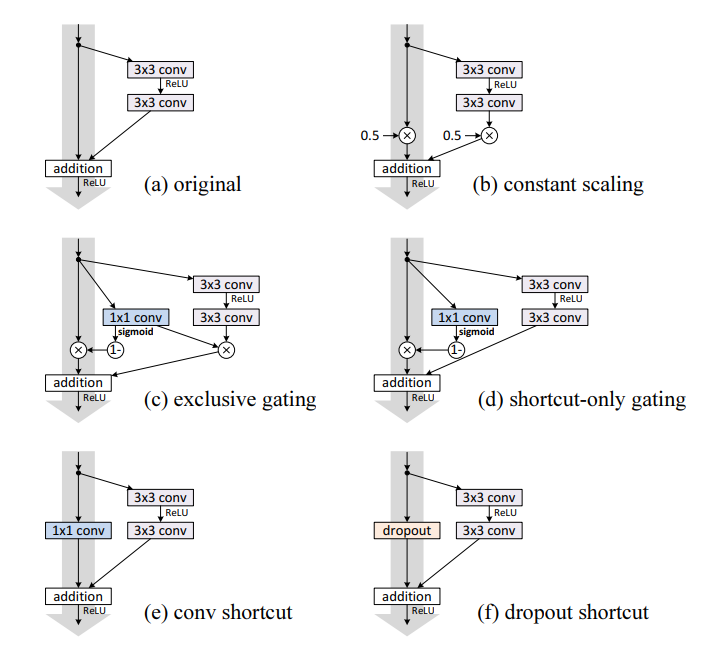
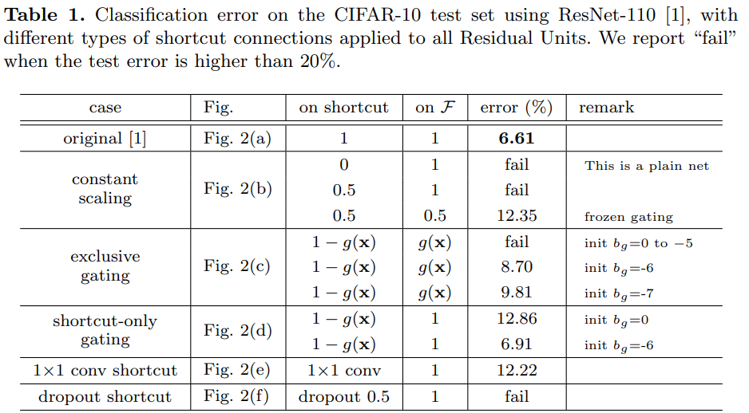

# [Identity Mapping in Deep Residual Networks](https://arxiv.org/pdf/1603.05027.pdf)

이 논문에서 저자는 Residual block의 propagation formulation을 분석했습니다. 또한 Skip connection을 하는 다양한 방식들을 분석했습다. 또한 다양한 activation 방식을 통해서 차이점들을 확인했습니다.

# Analysis of Deep Residual Networks.

논문 [\[1\]](https://arxiv.org/pdf/1512.03385.pdf)에서 표현한 Residual Unit은 아래와 같은 수식을 표현할 수 있습니다.

여기서 은 Residual Unit에서 l번째 입력값입니다. 는  l번째 Residual Unit와 연관된 모든 weights와 bias값의 총 집합입니다. 이때 하나의 Residual Unit은 K 겟수의 layer들을 가질수 있습니다.

만약 우리가 function h를 identity mapping 이라고 가정하고 function f 또한 identity mapping 가정한다면, 아래와 같은 수식으로 변환할 수 있습니다.

이 수식을 k = 1 부터 L 제귀적으로 합친다면, 우리는 아래와 같은 수식으로 바꿀 수 있습니다:

This equation have nice properties in understanding residual networks.

1. For any feature in deeper unit L, could be preseneted as the feature of shallower unit plus the resdual functions in form or summations
2. The feature of any deeper unit L, is the summation of the outputs of all preceding residual functions.

This recursing equation leads to nice backward propagation properties. The gradient of the equation above would be following.

This equation implies that the gradient of a layer does not vanish even when the weights are arbitrarily small.

# On the Importance of Identity Skip Connections

Let's modify the function h, =\lambda_lx_l) to break the identity shortcuts.

The value  is a modulating scalar.

Recursively implimenting this fomular re could get equation similar to equation 4 presented above.

Similar to equation 5, we could get back propagation of following:

Unlike Identity(equation5), equation 8 have a term . If , the product term would have exponentially large value. If , then the product term is exponentially small and vanish.

Thus if the layer is large, then using weighted value for shortcut would cause information propagation and impede the training procedure.

## Experiment on Skip Connections

Looking into above equations, as the layer increases, using skip connection that is not identity matrics would suffer decrease in the training error rate. Thus, author of the paper presents different shortcut variations.

Using different shortcut methods, Author examines difference between the skip connection methods and test error.

As shown in this Table, addind different layers to Skip Connection reports higher error rate compared to the identity mapping. Therefore, identity mapping is the best way to use the skip connections.

# On the Usage of Activation Function.

Experiment above talks about different techniques in Skip Connection. In this section, author moves attention from skip Connection to activation function. Finding the best order for activation function.

Author want to kind different arrangement of activation function that would increase the accuracy.

## Experiment on activation

Above image present different activation methods and their error rate using CIFAR 10 data and ResNet 110 and ResNet 164. ResNet 110 uses two  convolutional layers. On the other hand, ResNet 164 substitute two  convolutional layers with  convolutional layer and  convolutional layer and  convolutional layer.

ResNet 110 Residual Unit | ResNet 164 Residual Unit
:-----------------------:|:---------------------------:
 | 

Left image present the Residual Unti of ResNet 110, and Right image represent the Residual Unit of ResNet 164. Both ResNet110 and ResNet 164 have same 18 blocks of residual Unit but ResNet 164 have more layers since ResNet 164 have 3 Layers inside Residual Unit while Resnet 110 ahve only 1 layers.

As above image displays, using preactivation have marginal increase in Test error.
