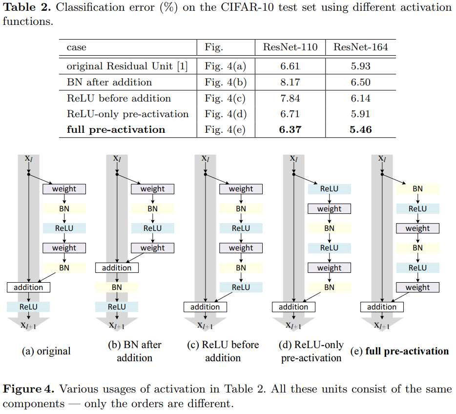
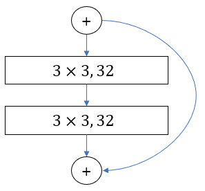
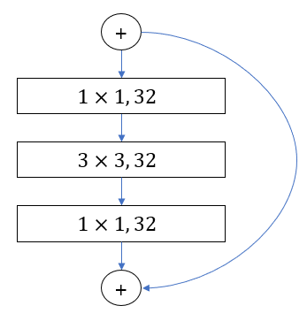

# [Identity Mapping in Deep Residual Networks](https://arxiv.org/pdf/1603.05027.pdf)

In this paper, author analyzes the propagation formulation behind the residual building blocks. Also author talks about different types of skip connections including identity mapping and after-addition activation.

# Analysis of Deep Residual Networks.

The original Residual Unit in [\[1\]](https://arxiv.org/pdf/1512.03385.pdf) performs following computation

Here  represents the input feature to the l-th Residual Unit. Also  is a set of weights and biases associated with the l-th Residual Unit, where it could have up to K number of layers.

If we set the function h as an identity mapping and function f also as an identity mapping, then we could assume following equation.

Recusively implimenting following equation from k = 1 to L, we will have:

This equation have nice properties in understanding residual networks.

1. For any feature in deeper unit L, could be preseneted as the feature of shallower unit plus the resdual functions in form or summations
2. The feature of any deeper unit L, is the summation of the outputs of all preceding residual functions.

This recursing equation leads to nice backward propagation properties. The gradient of the equation above would be following.

This equation implies that the gradient of a layer does not vanish even when the weights are arbitrarily small.

# On the Importance of Identity Skip Connections

Let's modify the function h, =\lambda_lx_l) to break the identity shortcuts.

The value  is a modulating scalar.

Recursively implimenting this fomular re could get equation similar to equation 4 presented above.

Similar to equation 5, we could get back propagation of following:

Unlike Identity(equation5), equation 8 have a term . If , the product term would have exponentially large value. If , then the product term is exponentially small and vanish.

Thus if the layer is large, then using weighted value for shortcut would cause information propagation and impede the training procedure.

## Experiment on Skip Connections

Looking into above equations, as the layer increases, using skip connection that is not identity matrics would suffer decrease in the training error rate. Thus, author of the paper presents different shortcut variations.

Using different shortcut methods, Author examines difference between the skip connection methods and test error. In this skip connections, a) original is from the paper Deep Residual Learning for Image Recongition, where using identity shortcut and zero padding for extanded dimensions. b) constant scaling is multiplying floats between 0 to 1 for skip connection and for residual functions. c) is exclusive gating which is adopted from Highway Net where gating funciton is  convolutional layer and applying sigmoid as activation function. In this exclusive gating, we use ) for shortcut connections and ) for residual function. d) shortcut only gating is similar to exclusive gating but only eliminating gating function on the residual function. e) is using  convolutional layer as a shortcut. Final, for f) adding dropout layer for shortcut connection.

As shown in this Table, addind different layers to Skip Connection reports higher error rate compared to the identity mapping. Therefore, identity mapping is the best way to use the skip connections.

# On the Usage of Activation Function.

Experiment above talks about different techniques in Skip Connection. In this section, author moves attention from skip Connection to activation function. Finding the best order for activation function.

Author want to kind different arrangement of activation function that would increase the accuracy.

## Experiment on activation

Above image present different activation methods and their error rate using CIFAR 10 data and ResNet 110 and ResNet 164. ResNet 110 uses two  convolutional layers. On the other hand, ResNet 164 substitute two  convolutional layers with  convolutional layer and  convolutional layer and  convolutional layer.

ResNet 110 Residual Unit | ResNet 164 Residual Unit
:-----------------------:|:---------------------------:
 | 

Left image present the Residual Unti of ResNet 110, and Right image represent the Residual Unit of ResNet 164. Both ResNet110 and ResNet 164 have same 18 blocks of residual Unit but ResNet 164 have more layers since ResNet 164 have 3 Layers inside Residual Unit while Resnet 110 ahve only 1 layers.

As above image displays, using preactivation have marginal increase in Test error.

## [Link to Original Version](../)
## [Link to Korean Version](../Korean/V2)